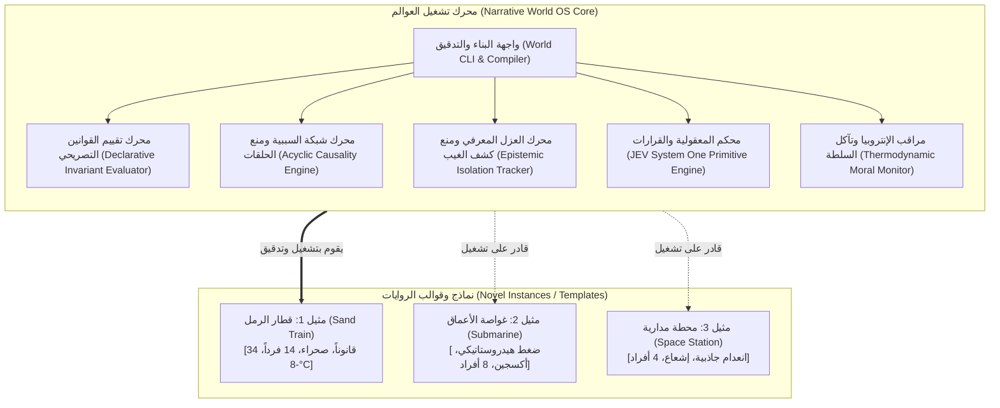

# وثيقة الهدف الاستراتيجي وخارطة الطريق المعمارية (World Engine Framework Roadmap)
### الانتقال من «كود رواية مخصص» إلى «نظام تشغيل عوالم سردية (Narrative World OS)»
**وسم الهدف (Milestone Tag):** `MILESTONE-NARRATIVE-OS-v1.0`  
**تاريخ التوثيق:** 2026-09-20  
**الحالة:** معتمد كهدف معماري حاكم قبل التنفيذ البرمجي  

---

## 1. وسم وتعريف الهدف الاستراتيجي (Goal Definition)

تحويل المعمارية البرمجية والهندسية التي شُيدت لإدارة رواية **«قطار الرمل»** من مجموعة أدوات خاصة ومقترنة بتفاصيل الرواية (Tightly Coupled Tools) إلى **محرك عوالم سردية نقي وتصريحي (Declarative Narrative World Engine / Framework)**، بحيث تصبح الرواية مجرد **عينة مرجعية وقالب تطبيقي (Gold-Standard Template / Instance)** يعمل فوق المحرك دون الحاجة لكتابة كود بايثون خاص لكل حدث أو قانون فيزيائي.



---

## 2. أين نحن الآن؟ (Current Baseline / As-Is State)

نحن نقف حالياً عند **~70% من النواة المجردة**، بينما تشكل الـ **~30% المتبقية ديناً معمارياً لاقتران الكود بالرواية**:

### أ. ما تم إنجازه وأصبح محايداً تماماً (Generic Framework Assets):
1. **محرك التحكيم الدلالي لـ JEV System One ([`02_TOOLS/jev_engine.py`](file:///d:/قطار%20الرمل/1/02_TOOLS/jev_engine.py)):**
   * مستقل تماماً عن تفاصيل أي رواية؛ يقبل سياقاً وحركة أو انفعالاً ويعيد حكماً نوعياً مشفوعاً باحتمالية (Choice, Score, Noul).
2. **محرك شبكة السببية ([`02_TOOLS/causality_graph.py`](file:///d:/قطار%20الرمل/1/02_TOOLS/causality_graph.py)):**
   * خوارزميات فحص الحلقات والتناقضات وحساب التدفق السببي عامة ونقية 100%.
3. **محرك العزل المعرفي الإبستمولوجي ([`02_TOOLS/epistemic_tracker.py`](file:///d:/قطار%20الرمل/1/02_TOOLS/epistemic_tracker.py)):**
   * منطق الحواجز والوسائط ونفي العلم الكلي (Omniscience) محايد ويمكن تطبيقه على أي فضاء مغلق.
4. **حزمة الاختبارات الشاملة والطفرات السلبية (`tests/`):**
   * 65 اختباراً ناجحاً بنسبة 100%، تؤكد قدرة المنظومة على إثبات قابلية التفنيد (Falsifiability).
5. **الاتساق العضوي المنظومي:**
   * اجتياز تقييم JEV بدرجة **1.99 / 2.0** وثقة 99%.

### ب. ما هو مقترن بقطار الرمل ويحتاج إلى تجريد (Coupling Bottlenecks):
1. **القوانين الفيزيائية مكتوبة نثرياً:**
   * القوانين الـ 34 مسجلة في [`PHYSICAL_LAWS.md`](file:///d:/قطار%20الرمل/1/01_SPECS_AND_RULES/PHYSICAL_LAWS.md) كشروح بشرية ورموز LaTeX، ولا يقرؤها الحاسوب كـ AST أو قواعد شرطية آلية.
2. **ثوابت برمجية مكتوبة داخل البايثون (Hardcoded Python Invariants):**
   * في [`02_TOOLS/world_auditor.py`](file:///d:/قطار%20الرمل/1/02_TOOLS/world_auditor.py) توجد دوال حصرية مثل:
     * `check_pneumatic_brake_invariant`: مكتوبة خصيصاً لمكابح ويستنغهاوس.
     * `check_diesel_paraffin_gelling_invariant`: مكتوبة خصيصاً لديزل قطار الرمل.
     * `check_excretion_and_atmosphere_invariant`: مبرمجة برقم 14 شخصاً و 3.5L.
     * فحص التعداد والذخيرة: أرقام صلبة (14 شخصية، 118 طلقة، 14 لتر ماء).
3. **غياب ملف تعريف العالم الموحد (`world_manifest.yaml`):**
   * خصائص العالم موزعة بين عدة ملفات، ولا يوجد ملف مدخلات قياسي واحد يُعرّف "حدود العالم وثوابته وموارده" ليقرأه المحرك.

---

## 3. أين نريد أن نصل؟ (Target Architecture / To-Be State)

الوصول إلى بيئة عمل معيارية يتحقق فيها الآتي:

### 1. نواة المحرك المستقلة (`world_engine/`)
* مكتبة برمجية عامة لا تحتوي على أي ذكر لـ «قطار» أو «رمل» أو «خالد» أو «سردار».
* تضم:
  * `InvariantEvaluator`: مفسر القوانين الفيزيائية والحيوية المكتوبة بصيغة تصريحية (Declarative DSL).
  * `CausalityOrchestrator`: إدارة تدفق الأحداث وتفرعاتها.
  * `EpistemicGovernor`: فحص الرؤية والسمع وانتقال المعلومة.
  * `JevSteeringBridge`: محاكمة المسودات السردية في الوقت الحقيقي.

### 2. لغة توصيف القوانين التصريحية (Declarative Rules Schema)
* كتابة القوانين في ملفات مهيكلة (YAML/JSON) تصف:
  * **المشغل (Trigger):** متى ينشط القانون بيئياً أو جسدياً؟
  * **الشرط الحتمي (Invariant):** المعادلة أو القيد الذي يُمنع خرقه.
  * **الأثر (Mutation):** ما الذي يتغير في حالة العالم عند وقوع القانون؟
  * **الجزاء السردي (Severity):** هل الخرق خطأ مميت (Fatal Invariant) أم تحذير أسلوبي؟

### 3. رواية «قطار الرمل» كقالب مرجعي ذهبي (Gold-Standard Instance)
* مجلد كامل للرواية يحتوي على:
  * `world_manifest.yaml`: تعريف الصحراء، الصقيع، طوبولوجيا العربات، الموارد.
  * `rules_catalog.yaml`: القوانين الـ 34 مصاغة وفق الـ DSL الجديد.
  * `entities_catalog.yaml`: الشخصيات الـ 14 والمعدات.
  * `causality_graph.yaml`: شبكة الأحداث الـ 16.
* تشغيل مدقق المحرك العام على هذا المجلد:
  ```bash
  python -m world_engine audit --world instances/sand_train
  # النتيجة: اجتياز 100% لكافة القوانين دون وجود سطر كود واحد مخصص للقطار داخل المحرك!
  ```

### 4. إمكانية البناء التلقائي لعالم جديد (World Auto-Scaffolding)
* إطلاق قالب عالم جديد بأمر واحد:
  ```bash
  python -m world_engine new --name "DeepSubmarine" --template "closed_survival"
  ```
  يقوم بإنشاء الهيكل الفارغ، والتحقق من سلامة القوانين، وتجهيز المحاكاة فوراً.

---

## 4. خطة المراحل التنفيذية المتدرجة (Phased Execution Plan)

> [!CAUTION]
> يُمنع تنفيذ أي تغييرات كاسرة (Breaking Changes) دفعة واحدة. يجب أن تظل حزمة الاختبارات الحالية (65/65) ناجحة دائماً في كل مرحلة.

### المرحلة 1: صياغة المخطط المعياري لعقد العالم (World Specification Schema)
* تصميم مواصفة `world_manifest.schema.json` و `rule.schema.json`.
* عدم المساس بالكود الحالي، بل بناء المخطط واختباره نظرياً ومطابقته على قوانين قطار الرمل.

### المرحلة 2: بناء محرك القوانين التصريحي (Declarative Invariant Evaluator)
* بناء أداة تفكك شروط القوانين (مثلاً: `temperature < -6.0 -> engine.locked = true`) دون كود مخصص.
* نقل قانونين كعينة تجريبية (`LAW-CHEM-01` و `LAW-PNEUM-01`) وإثبات نجاح الفحص التصريحي مقابل الفحص الصلب.

### المرحلة 3: التجريد الهيكلي المنظم (Core Engine & Instance Separation)
* فصل النواة العامة في مجلد مخصص (`world_engine/`).
* عزل بيانات قطار الرمل كـ Instance متكامل.
* إعادة توجيه `pytest` ليعمل عبر المحرك العام ويؤكد نجاح الـ 65 اختباراً دون فقدان أي وظيفة.

### المرحلة 4: اختبار العالم المصغر النقي (Micro-World Falsification Test)
* بناء عالم تجريبي وهمي مصغر (مثل: "غرفة محكمة فيها شخصان وشمعة واحدة وأكسجين ينفد في 60 دقيقة").
* تشغيل المحرك عليه لإثبات أنه يتعامل مع أي فيزياء وأي شخصيات بتلقائية مطلقة ودون تدخل بشري في الكود.

---

## 5. ميثاق الأمان والضمانات الحاكمة
1. **المتن الأصلي خط أحمر:** عدم المساس بملف [`00_BASELINE/novel_baseline.md`](file:///d:/قطار%20الرمل/1/00_BASELINE/novel_baseline.md).
2. **استمرارية الاختبارات الخضراء:** عدم قبول أي خطوة تؤدي لرسوب أي اختبار من الـ 65 اختباراً.
3. **الحياد الإبداعي:** المحرك يقيس ويدقق الاتساق المنظومي ولا يتدخل في بلاغة الكاتب أو أسلوبه الأدبي.
