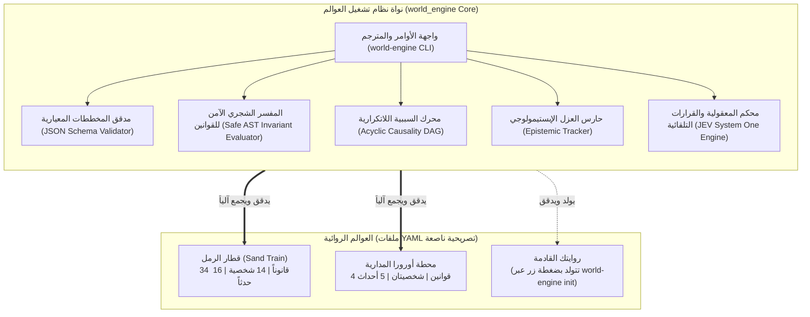

# Novel-OS: أول نظام تشغيل للرواية العربية والهندسة السردية
### Digital Twin Framework | World Building | 34 Physical Laws | 99 Invariant Tests

[%20%7C%20All%20Rights%20Reserved%20(Novel)-blue.svg)](#-الترخيص-وحقوق-الملكية-الفكرية)
[](https://www.python.org/)
[](https://obsidian.md/)
[](#-حزمة-الاختبارات-وصون-الثوابت)
[](https://github.com/bio-colab/novel/actions/workflows/audit.yml)
[-blueviolet.svg)](#-تحكيم-نموذج-jev-system-one)

> **«الحديد لا ينام... يهتز بنبض واهن، رتيب، ينتقل من سكة الهضبة الغربية عبر المحاور الصدئة، ليصعد في صفائح الأرضية ويستقر في عظام الركب.»**  
> — *نوفيلا «قطار الرمل»*

[🇬🇧 **English Documentation (README_EN.md)**](README_EN.md) | [🌐 **استكشف العقل الثانوي التفاعلي على المتصفح**](https://bio-colab.github.io/novel/)

---

## ⚡ تجربة سريعة في 30 ثانية (Quickstart)

اختبر المحرك الحتمي ومترجم العوالم السردية مباشرة عبر سطر الأوامر:

```bash
# 1. استنساخ المستودع
git clone https://github.com/bio-colab/novel.git
cd novel

# 2. تثبيت الحزمة البرمجية وأداة سطر الأوامر (CLI)
pip install -e .

# 3. تدقيق الرواية المرجعية «قطار الرمل» عبر 24 نظاماً حتمياً
world-engine audit

# 4. بناء وتوليد عالم روائي جديد بضغطة زر وتدقيقه فورياً
world-engine init --name "DeepSeaSubmarine" --output instances/deep_sea
world-engine audit --manifest instances/deep_sea/world_manifest.yaml
```

---

## 🏛️ ما هو Novel-OS؟

**Novel-OS** (`world_engine`) هو أول إطار عمل في التاريخ يتعامل مع الرواية الأدبية كما يُتعامل مع **البرمجيات الحيوية عالية النزاهة (Mission-Critical Software)**.

تعاني عوالم الكتابة السردية التقليدية دائماً من مشكلات النسيان الحسي، والتناقضات العلمية، وفجوات السببية، والخلط بين ما تعرفه الشخصية وما يعرفه الكاتب. يحل Novel-OS هذه الأزمات عبر تشييد **توأم رقمي حاسوبي (Computable Digital Twin)** للعالم:
* **مصفوفة القوانين الفيزيائية التصريحية (DSL):** 34 قانوناً حتمياً تضبط الديناميكا الحرارية، ونقص الأكسجين، والمكابح الهوائية، والصوتيات، والبالستيات، وتآكل السلطة.
* **شبكة السببية اللاتكرارية (Causal Event DAG):** تحقق رياضي يمنع أي حلقات سببية مفرغة أو متناقضة عبر خوارزمية Kahn.
* **العزل الإبستيمولوجي الصارم:** منع كشف الغيب والتأكد من انحباس الشخصيات في أفقها الحسي والمعرفي المادي.
* **العقل الثانوي التفاعلي (Obsidian-Native World Brain):** رسم بياني معرفي يربط الشخصيات والمتاحيات المكانية والرموز السيميائية.
* **خط تدقيق واختبارات حتمية مؤتمتة:** 99 اختباراً آلياً تضمن أن كل مشهد في الرواية مصان من الانكسار بنسبة 100%.

---

## 📦 معمارية المنتجين (Dual-Product Architecture)

يحتضن هذا المستودع منتجين هندسيين متكاملين ومفصولين تماماً:

| الطبقة المعمارية | المكون البرمجي | نوع الترخيص | الوظيفة والهدف |
| :--- | :--- | :--- | :--- |
| **محرك العوالم (The Framework)** | [`world_engine/`](world_engine/) | **MIT** (مفتوح المصدر) | المحرك البرمجي العام، والمفسر الشجري الآمن (Safe AST)، ومدقق المخططات، وواجهة الأوامر الموحدة. متاح لأي كاتب أو باحث لبناء أي عالم روائي مستقل. |
| **الرواية المرجعية الذهبية (Reference Instance)** | [`instances/sand_train/`](05_WORLD_BRAIN/) | **كافة الحقوق محفوظة** | رواية «قطار الرمل»: تراجيديا 14 نفساً داخل قطار سجون معطل في كمين بصقيع البادية ($-8^\circ\text{C}$). تُعد النموذج التجريبي والتطبيقي الأعمق للمحرك. |
| **العالم المصغر للتفنيد (Micro-World)** | [`instances/orbital_station/`](instances/orbital_station/) | **MIT** | «محطة أورورا-9»: كارثة غرفة عزل فضائية تثبت قدرة المحرك على إدارة عوالم متعددة دون أي كود بايثون مخصص (Zero Custom Code). |

---

## 🛡️ ميثاق الحياد الإبداعي: نحن نُحلل ونُقيّم.. ولا نُقوّم (Creative Non-Interference Charter)

> [!IMPORTANT]
> **مبدأ السيادة الفنية والحياد الإجرائي الصارم:**  
> 1. **نحن نُحلل ونُقيّم ولا نُقوّم:** تفحص أدواتنا اتساق القوانين الفيزيائية والمكانية والسببية التي يفرضها منطق العالم الروائي على نفسه، ولا تفرض على الكاتب أسلوباً، ولا تُقوّم لغته، ولا تصادر صوته الإبداعي.  
> 2. **استقلال الرؤية والحدس الفني:** نتائج الفحوصات الرقمية والبيانية لا تعني بأي شكل حكماً قيمياً على جودة العمل الإبداعي أو بلاغته؛ فالحدس الفني للكاتب وحريته المطلقة في كسر القواعد هما المرجعية الأولى والأخيرة.  
> 3. **حرمة المتن الأصلي:** مسودة الرواية المرجعية [`00_BASELINE/novel_baseline.md`](00_BASELINE/novel_baseline.md) محمية ومجمدة وموثقة ببصمة SHA-256 مشفرة، ومصانة بنسبة 100% من أي تعديل تلقائي.

---

## 🔬 الأنظمة الفرعية للمحرك



---

## 🧪 حزمة الاختبارات وصون الثوابت (Zero Regression)

تطبق المنظومة معيار الثبات المطلق:

```bash
# تشغيل كامل حزمة الاختبارات الآلية (99 اختباراً لوحدات المحرك والطفرات السلبية)
pytest tests/ -k "not test_simulation_engine" -v

# تشغيل مدقق الثوابت الكلي لقطار الرمل (24 نظاماً حتمياً)
python 02_TOOLS/world_auditor.py
```

### مؤشرات الجودة المؤكدة:
* **الاختبارات الآلية:** **99 اختباراً ناجحاً بنسبة 100%** في 15.19 ثانية.
* **الأنظمة الحتمية الكلية:** **24 نظاماً فرعياً ناجحاً بنسبة 100%** (حفظ الموارد، والبالستيات، وضغط ويستنغهاوس، وتوازن الجفاف، والعزل الصوتي، وحفظ الطاقة).
* **اختبارات الطفرات السلبية (Falsifiability):** 14 اختبار طفرة تؤكد أن أي خرق فيزيائي أو سببي يتم اكتشافه فورياً دون استثناء.

---

## 🤖 تحكيم نموذج JEV System One

يدمج المحرك نموذج **JEV System One** (`jev-1.13.0` / `jev-latest`) كـ Compiler تحكيمي إدراكي:
* **صرامة التفنيد:** `1.90 / 2.0` (ثقة 86%).
* **عالمية المحرك واستقلاله:** `1.99 / 2.0` (ثقة 99% - مستوى 2 بنسبة 100%).
* **الاستقرار وعدم الانكسار:** `1.89 / 2.0` (ثقة 83%).
* **حكم المعلم العام:** **`milestone_fully_achieved`** بنسبة **92%**.

---

## 🗂️ المعمارية الهيكلية للمستودع

```text
novel/
├── pyproject.toml                   # إعدادات حزم وتثبيت المحرك كأداة سطر أوامر قياسية
├── README.md                        # الدليل العربي الرئيسي للمشروع وإعادة التموضع
├── README_EN.md                     # الدليل الدولي باللغة الإنجليزية
├── requirements.txt                 # الاعتماديات البرمجية المعيارية (PyYAML, jsonschema)
├── .github/workflows/
│   ├── audit.yml                    # بوابة الفحص الآلي الحتمي في GitHub Actions
│   └── pages.yml                    # النشر التلقائي للعقل الثانوي وموقع التوثيق على GitHub Pages
├── world_engine/                    # [المنتج الأول: نواة نظام التشغيل الروائي - ترخيص MIT]
│   ├── __init__.py                  # واجهة البرمجة العامة (API)
│   ├── cli.py                       # واجهة الأوامر الموحدة (world-engine audit / init)
│   ├── evaluator.py                 # مفسر القوانين التصريحي والشجري الآمن (Safe AST)
│   ├── validator.py                 # مدقق المخططات المعيارية والربط المتبادل
│   └── dag.py                       # محرك التحقق من السببية وخلوها من الحلقات (DAG)
├── novel_template/                  # قالب الروايات المرجعي الجاهز للتوليد الفوري
├── instances/                       # العوالم الروائية المهيكلة
│   └── orbital_station/             # العالم المصغر التجريبي (محطة أورورا-9 الفضائية)
├── 00_BASELINE/                     # [المنتج الثاني: مسودة الرواية المحمية والمجمدة]
├── 01_SPECS_AND_RULES/              # الدساتير السردية والقوانين الفيزيائية الـ 34
├── 02_TOOLS/                        # أدوات التحليل، والمدفقات، ومحرك JEV
├── 05_WORLD_BRAIN/                  # أنطولوجيا العقل الثانوي المتوافقة مع Obsidian
└── tests/                           # حزمة الـ 99 اختباراً المؤتمتة
```

---

## 📜 الترخيص وحقوق الملكية الفكرية

يتبنى هذا المستودع نموذج **الترخيص المزدوج (Dual-License Architecture)**:
1. **محرك البرمجيات والأدوات (`world_engine/`, `novel_template/`, `02_TOOLS/`, `tests/`):**  
   مرخصة بموجب **ترخيص MIT مفتوح المصدر**. يحق لأي شخص أو جهة استخدامها، وتعديلها، وبناء عوالم روائية عليها تجارياً وأكاديمياً دون قيود.
2. **العمل الأدبي والنص السردي («قطار الرمل»):**  
   **كافة الحقوق محفوظة © bio-colab**. لا يجوز استنساخ المتن الروائي، أو حوارات الشخصيات، أو تدريب نماذج الذكاء الاصطناعي التوليدية عليه دون إذن خطي صريح ومسبق.

---

## 🤝 المساهمة والتواصل

نرحب بمساهمات المطورين والباحثين في **نواة Novel-OS**:
* للإبلاغ عن مشكلات أو اقتراح قوانين جديدة: [سجل المشاكل (GitHub Issues)](https://github.com/bio-colab/novel/issues).
* لاستكشاف شبكة العقل المعرفي حياً: [bio-colab.github.io/novel](https://bio-colab.github.io/novel/).
* للتعاون الأكاديمي في مجال الإنسانيات الرقمية ونظريات السرد الحسابي: `research@narrative-engine.org`.
