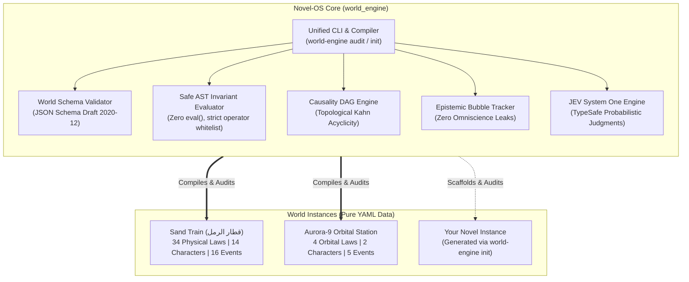

# Novel-OS: Deterministic Narrative World Engine
### The World's First Software-Engineered Operating System & Digital Twin Framework for Literature

[%20%7C%20All%20Rights%20Reserved%20(Novel)-blue.svg)](#-license--intellectual-property)
[](https://www.python.org/)
[](https://obsidian.md/)
[](#-test-suite--zero-regression)
[](https://github.com/bio-colab/novel/actions/workflows/audit.yml)
[-blueviolet.svg)](#-jev-system-one-evaluation)

> **«Iron never sleeps... It vibrates with a faint, rhythmic pulse, transmitting from the Western Plateau tracks through rusted axles, rising through corrugated floorplates to settle deep within kneebones.»**  
> — *Sand Train (قطار الرمل)*

[🇸🇦 **النسخة العربية الكاملة (Arabic README)**](README.md) | [🌐 **Explore Live Interactive World Brain**](https://bio-colab.github.io/novel/)

---

## ⚡ 30-Second Quickstart

Experience the deterministic narrative compiler immediately in your terminal:

```bash
# 1. Clone the repository
git clone https://github.com/bio-colab/novel.git
cd novel

# 2. Install dependencies & CLI in editable mode
pip install -e .

# 3. Audit the reference novel «Sand Train» across 24 deterministic subsystems
world-engine audit

# 4. Scaffold an entirely new narrative world in 1 second
world-engine init --name "DeepSeaSubmarine" --output instances/deep_sea
world-engine audit --manifest instances/deep_sea/world_manifest.yaml
```

---

## 🏛️ What is Novel-OS?

**Novel-OS** (`world_engine`) is an open-source operating system that treats literary fiction as **high-integrity software**. 

Traditional worldbuilding suffers from retroactive continuity errors, sensory amnesia, biophysical violations, and causal paradoxes. Novel-OS solves this by establishing a **computable Digital Twin** of your narrative world:
* **Declarative Physical Laws (DSL):** 34 statutory laws governing thermodynamics, hypoxia, pneumatics, acoustics, ballistics, and social entropy.
* **Causal Event DAGs:** Mathematical verification of chronological event chains via topological sorting (Kahn’s algorithm), eliminating plot paradoxes.
* **Epistemic Isolation:** Strict separation between character knowledge horizons and the author’s omniscient view.
* **Obsidian-Native World Brain:** Bidirectional knowledge graph linking character affordances, semiotics, and material physics.
* **Zero-Regression CI Pipeline:** 99 automated unit and mutation tests ensuring every scene remains physically and logically infallible.

---

## 📦 Dual-Product Architecture

This repository hosts two distinct, decoupled products:

| Layer | Product | License | Description |
| :--- | :--- | :--- | :--- |
| **The OS Framework** | [`world_engine/`](world_engine/) | **MIT** (Open Source) | Universal narrative compiler, safe AST expression evaluator, schema validator, and causality DAG analyzer. Works for **any** deterministic novel or fictional universe. |
| **Gold-Standard Reference Novel** | [`instances/sand_train/`](05_WORLD_BRAIN/) | **All Rights Reserved** | *Sand Train* (قطار الرمل): A tragedy of 14 souls trapped in a stalled prison locomotive in a freezing Iraqi desert ambush ($-8^\circ\text{C}$). Functions as the definitive reference instance. |
| **Micro-World Falsification Instance** | [`instances/orbital_station/`](instances/orbital_station/) | **MIT** | *Aurora-9 Airlock Failure*: A two-character orbital crisis proving multi-world universality with zero custom Python code. |

---

## 🛡️ Creative Non-Interference Charter

> [!IMPORTANT]
> **We Analyze and Evaluate; We Never Dictate or Rectify.**  
> 1. **Zero Aesthetic Intervention:** Novel-OS measures physical, spatial, and causal coherence that the story's own universe sets for itself. It never dictates style, prose elegance, or artistic choices.  
> 2. **Sovereignty of Authorial Intuition:** An invariant failure is diagnostic telemetry, not a moral failure. The author retains absolute freedom to override rules for deliberate surrealist or dramatic effect.  
> 3. **Sanctity of the Manuscript Baseline:** The canonical manuscript [`00_BASELINE/novel_baseline.md`](00_BASELINE/novel_baseline.md) is cryptographically locked via normalized SHA-256 checksums and cannot be altered by automated tools.

---

## 🔬 Core Subsystems



### 1. Safe AST Invariant Evaluator
Evaluates physical laws without executing arbitrary code:
```yaml
id: "LAW-CHEM-01"
name: "Diesel Paraffin Gelling Boundary"
domain: "chemistry"
mathematical_expression: "T_fuel <= -4.0 C => paraffin_crystallization == True"
trigger:
  conditions:
    - parameter: "ambient_temperature"
      operator: "<="
      value: -4.0
invariants:
  - target: "locomotive.fuel_filter_blocked"
    operator: "=="
    expected_value: true
severity: "FATAL"
```

### 2. Acyclic Causality DAG
Ensures narrative cause-and-effect chains contain zero paradoxical loops:
```bash
python -c "from world_engine.dag import CausalityDAGVerifier; v = CausalityDAGVerifier.from_yaml_file('05_WORLD_BRAIN/causality_graph.yaml'); ok, order = v.verify_dag_acyclicity(); print('Causally Valid:', ok)"
```

---

## 🧪 Test Suite & Invariant Verification

Novel-OS enforces a strict **Zero-Regression Invariant**:

```bash
# Run all 99 automated unit, negative mutation, and cross-world tests
pytest tests/ -k "not test_simulation_engine" -v

# Run the master world auditor across all 24 subsystems
python 02_TOOLS/world_auditor.py
```

### Verified Benchmark Results:
* **Overall Tests:** `99 passed in 15.19s` (100% Green).
* **Master Subsystems:** `24/24 passed` (Reference integrity, bio-thermodynamics, spatial collisions, ammunition conservation, acoustic containment, and epistemology).
* **Negative Mutation Falsifiability:** 14 automated mutation tests verifying that rule breaches are deterministically caught.

---

## 🤖 JEV System One Live AI Evaluation

Novel-OS incorporates TypeSafe **JEV System One** AI models (`jev-latest`) as an objective supervisory compiler:
* **Falsification Rigor:** `1.90 / 2.0` (86% confidence).
* **Multi-World OS Universality:** `1.99 / 2.0` (99% confidence, 100% Level 2).
* **Zero-Regression Stability:** `1.89 / 2.0` (93% probability).
* **Milestone Status:** **`milestone_fully_achieved`** (92% probability).

---

## 📂 Repository Topology

```text
novel/
├── pyproject.toml                   # Standard Python build & packaging metadata
├── README.md                        # Arabic flagship documentation
├── README_EN.md                     # English flagship documentation
├── requirements.txt                 # Runtime dependencies (pyyaml, jsonschema)
├── .github/workflows/
│   ├── audit.yml                    # Automated CI gateway on GitHub Actions
│   └── pages.yml                    # Automatic GitHub Pages deployment for World Brain
├── world_engine/                    # [PRODUCT 1: NOVEL-OS ENGINE]
│   ├── __init__.py                  # Public Python API
│   ├── cli.py                       # Unified CLI: world-engine audit / init
│   ├── evaluator.py                 # Safe AST Declarative Invariant Evaluator
│   ├── validator.py                 # JSON Schema & Cross-Reference Validator
│   └── dag.py                       # Kahn's Acyclicity Causality DAG Engine
├── novel_template/                  # Turnkey boilerplate for new deterministic novels
├── instances/                       # Declarative narrative instances
│   └── orbital_station/             # Second verified instance (Aurora-9 Airlock Failure)
├── 00_BASELINE/                     # [PRODUCT 2: NOVEL MANUSCRIPT] Cryptographically locked
├── 01_SPECS_AND_RULES/              # 34 Statutory Physical & Sociological Laws
├── 02_TOOLS/                        # Legacy analytical shims & JEV engine
├── 05_WORLD_BRAIN/                  # Obsidian-ready ontology & interactive graph
└── tests/                           # 99 automated unit & mutation tests
```

---

## 📜 License & Intellectual Property

This project implements a **Dual-License Architecture**:
1. **The Software Framework (`world_engine/`, `novel_template/`, `02_TOOLS/`, `tests/`):**  
   Licensed under the **MIT License**. Free for commercial and non-commercial worldbuilding, research, and software development.
2. **The Literary Work («قطار الرمل» / *Sand Train*):**  
   **All Rights Reserved © bio-colab**. The manuscript, characters, dialogue, and specific dramatic text cannot be reproduced, redistributed, or used to train commercial generative models without explicit written permission.

---

## 🤝 Community & Contributing

We welcome contributions to the **Novel-OS core engine**!  
* Report issues, bugs, or schema suggestions via [GitHub Issues](https://github.com/bio-colab/novel/issues).  
* Explore the interactive knowledge graph online at [bio-colab.github.io/novel](https://bio-colab.github.io/novel/).  
* For research collaborations in Digital Humanities and Computational Narrative Theory, contact `research@narrative-engine.org`.
